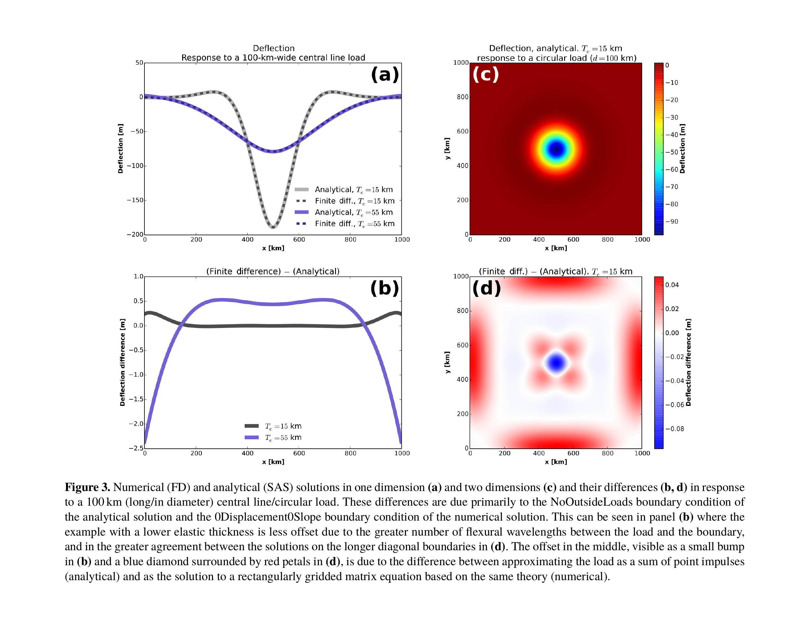

Numerical Accuracy
==================

Each solution method in gFlex has a distinct accuracy profile.

Analytical solutions (``SAS`` and ``SAS_NG``)
----------------------------------------------

The superposition-of-analytical-solutions methods are **exact** for a plate
of constant elastic thickness under the ``NoOutsideLoads`` boundary condition
(zero deflection at infinity).  In one dimension the Green's function is the
exponential sinusoid of Eq. (3) in Wickert (2016); in two dimensions it is the
zeroth-order Kelvin function :math:`\mathrm{kei}`, evaluated via
:func:`scipy.special.kei`.  Floating-point errors in these special-function
evaluations are at machine precision and negligible in practice.

The only meaningful source of error is a **domain that is too small**: if the
load produces non-trivial deflection at the domain boundary, the
``NoOutsideLoads`` assumption is violated and the solution is physically
wrong — not because of numerics, but because the boundary condition does not
match the situation.  Use :func:`gflex.flexural_wavelengths` to estimate the
flexural parameter :math:`\alpha` and ensure the domain extends several
:math:`\alpha` beyond the loaded region.  Unlike the finite difference solver,
there is no grid-spacing error; output sampling density affects only the
display, not the solution.

FFT spectral solver
-------------------

The FFT solver is **spectrally accurate** for uniform elastic thickness: for a
smooth load field the solution error decays faster than any finite power of the
grid spacing, limited in practice only by floating-point arithmetic.  For
periodic boundary conditions (``Periodic`` on all sides) the solution is exact
to machine precision.  For all other boundary conditions the load is
zero-padded by :math:`4\alpha` on each side before the transform, which
approximates the ``NoOutsideLoads`` condition; the padding introduces a small
error near the domain edges that decreases as the pad width increases relative
to the load's flexural footprint.  For typical geoscience applications the
:math:`4\alpha` default padding is more than sufficient.

Because the FFT assumes a single, spatially uniform flexural rigidity
:math:`D`, it cannot represent variable-:math:`T_e` problems; those require
the finite difference solver.

Finite difference solver (``FD``)
---------------------------------

   Comparison of numerical (FD) and analytical (SAS) solutions in one dimension
   **(a)** and two dimensions **(c)**, and their differences **(b, d)**, for a
   100 km central line load / circular load.  The 1–2 m offset in **(b)** is due
   primarily to the ``NoOutsideLoads`` BC of the analytical solution versus the
   ``0Displacement0Slope`` BC of the FD solution; the cross-shaped residual in
   **(d)** reflects boundary effects along the longer diagonal boundaries.
   Reproduced from Wickert (2016), Fig. 3;
   `CC BY 3.0 <https://creativecommons.org/licenses/by/3.0/>`_.

----

2-D finite-difference solver: second-order convergence
-------------------------------------------------------

The 2-D finite-difference solver (``Method = 'FD'``) is second-order accurate in space: halving the grid spacing
:math:`\Delta x` reduces the numerical error by a factor of approximately
four (:math:`\mathcal{O}(\Delta x^2)`).

This is verified two ways in gFlex:

1. **Method of Manufactured Solutions (MMS)** — a formal unit test
   (:func:`tests.test_2D_FD.test_2d_fd_convergence_order`) that runs with every
   CI build.  A cosine deflection field is chosen as the exact solution; the
   corresponding load is derived analytically and fed to the solver.  Three grid
   refinements (N = 30, 60, 120 cells per side) on a periodic domain confirm a
   convergence rate > 1.8 at all refinement levels.

2. **Kelvin-function benchmark** — a grid-convergence study comparing the FD
   solver to the analytical Kelvin-function solution for an infinite plate under
   a point load.  Results are summarised in the table below.

Kelvin-function benchmark setup
~~~~~~~~~~~~~~~~~~~~~~~~~~~~~~~~

.. list-table::
   :widths: 30 70
   :header-rows: 0

   * - Young's modulus :math:`E`
     - 65 GPa
   * - Elastic thickness :math:`T_e`
     - 10 km
   * - Poisson's ratio :math:`\nu`
     - 0.25
   * - Mantle density :math:`\rho_m`
     - 3300 kg m⁻³
   * - Infill density :math:`\rho_\text{fill}`
     - 0 kg m⁻³ (air)
   * - :math:`g`
     - 9.81 m s⁻²
   * - Flexural parameter :math:`\alpha`
     - ≈ 21 km
   * - Domain
     - 600 km × 600 km, point load at centre
   * - Boundary conditions
     - ``0Moment0Shear`` on all four sides
   * - Grid spacings tested
     - :math:`\Delta x` = 10 000, 5 000, 2 500, 1 250 m

Convergence orders (coarse → fine)
~~~~~~~~~~~~~~~~~~~~~~~~~~~~~~~~~~~

The table gives the local convergence order between successive grid refinements
at several distances from the load, expressed as multiples of the flexural
parameter *α*.

.. list-table::
   :header-rows: 1
   :widths: 15 20 20 20

   * - :math:`r/\alpha`
     - :math:`\Delta x` 10→5 km
     - :math:`\Delta x` 5→2.5 km
     - :math:`\Delta x` 2.5→1.25 km
   * - 0.97
     - 2.20
     - 2.07
     - 2.01
   * - 1.46
     - 2.68
     - 2.18
     - 2.04
   * - 1.95
     - 1.07
     - 1.88
     - 1.97
   * - 2.92
     - −0.07
     - 1.77
     - 1.95

At the finest spacing (:math:`\Delta x = 1250` m,
:math:`\Delta x/\alpha \approx 0.06`) relative errors are 0.02–0.1 %
everywhere except very close to the singularity of the point load.

The sub-second-order rates at :math:`r/\alpha` = 1.95 and 2.92 on the
coarsest grids reflect pre-asymptotic effects near the forebulge
zero-crossing, where the solution changes sign and the absolute error
temporarily dominates the relative error.  All rates converge to ≈ 2 at
finer resolution, confirming asymptotic second-order behaviour.

Practical guidance
~~~~~~~~~~~~~~~~~~

For most geoscience applications, :math:`\Delta x / \alpha \leq 0.1` (ten
cells per flexural parameter) is sufficient to keep errors below 1 %.  At
:math:`\Delta x / \alpha \approx 0.5` (two cells per flexural parameter)
errors can be several percent, particularly near the load centre and the
forebulge.  Use :func:`gflex.flexural_wavelengths` to estimate :math:`\alpha`
before choosing a grid spacing.
