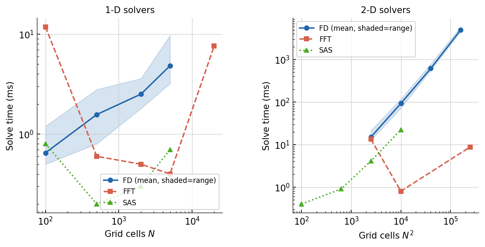
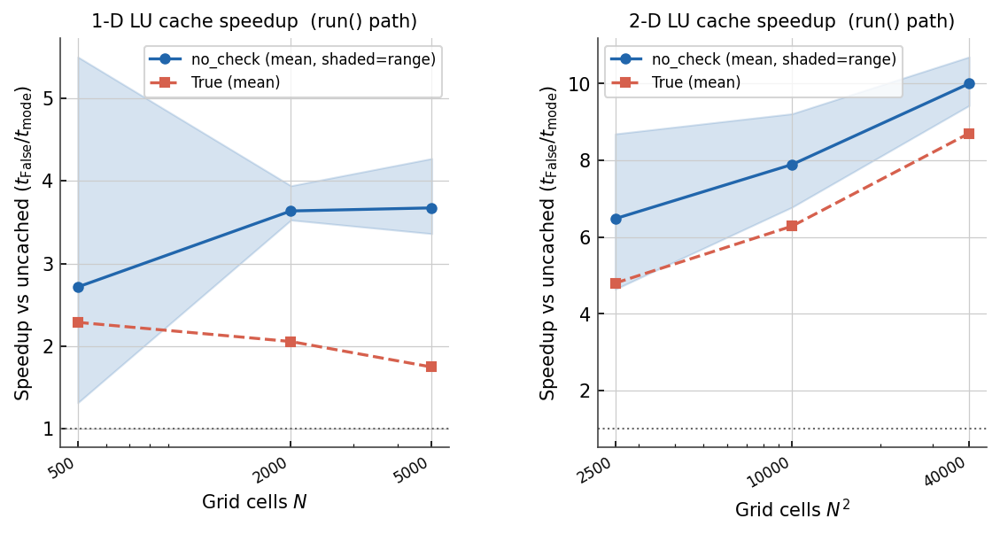
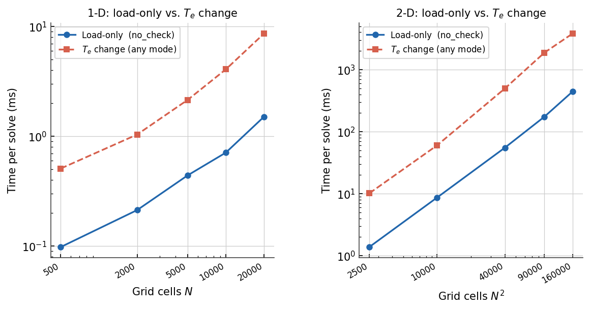
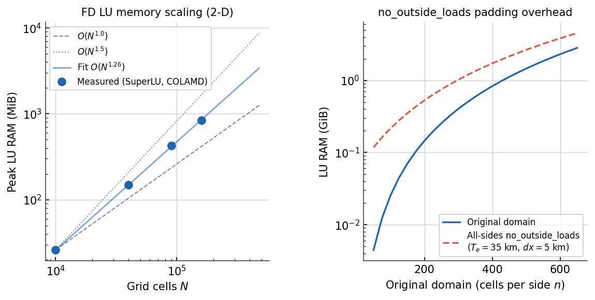

Performance
===========

The figures on this page were produced by running ``benchmarks/bench_solvers.py``
from the repository root.  To regenerate the figures from a fresh benchmark run::

   python benchmarks/bench_solvers.py
   python benchmarks/plot_results.py

Hardware context for the results shown here:

* **CPU**: AMD Ryzen 7 7840U (16 logical cores)
* **RAM**: 46.4 GiB
* **OS**: Linux 6.17, Ubuntu 24.04
* **Python** 3.12.7 · **NumPy** 1.26.4 · **SciPy** 1.16.3

Absolute timings will differ on other hardware; relative performance between
methods and cache modes is broadly representative.

Solver scaling
--------------

The **FD direct solver** uses a sparse LU factorisation and scales roughly as
:math:`O(N^{1.5})` in two dimensions, where :math:`N` is the total number of
grid cells.  At 400×400 cells (:math:`N^2 = 160\,000`) a single FD solve takes
about 5 s; at 200×200 it takes about 0.6 s.
In one dimension the cost is far lower: at 100–2,000 cells a 1-D FD solve
completes in under 1 ms on this hardware, and even a 10,000-cell domain takes
well under 10 ms.  One-dimensional FD is effectively instantaneous at any
realistic grid size.

The **FFT** method solves the problem in the spectral domain and scales as
:math:`O(N \log N)`.  In two dimensions it is roughly two orders of magnitude
faster than FD at the same grid size: a 400×400 solve takes about 5 ms and a
1000×1000 solve about 40 ms on this hardware.  FFT requires a uniform (scalar)
elastic thickness and imposes periodic boundary conditions (or zero-padded
behaviour with ``no_outside_loads``).

The **SAS** method superposes analytical deflection kernels using
``fftconvolve``, scaling as :math:`O(N \log N)` in total cell count.  It is
load-pattern-independent and consistently faster than FD at all practical grid
sizes: at 100×100 cells SAS takes about 20 ms versus 70 ms for FD; at 300×300
cells SAS takes about 0.2 s versus 2 s for FD (roughly 10× faster).  Because
the ``fftconvolve`` step scales as :math:`O(N \log N)` — the same asymptotic
order as FFT — while the FD LU factorisation scales as :math:`O(N^{1.5})`, SAS
maintains its advantage as grids grow.  SAS also requires a uniform elastic
thickness.

The Te profile has a modest effect on FD timing: the shaded band (min to max
across all profiles tested — constant, sinusoidal, abrupt step, tanh sigmoidal,
correlated noise, wide dynamic range) is narrow, typically within ±15 % of the
mean.  Spatially noisy profiles show slightly higher times at large grid sizes,
likely due to increased fill-in during sparse LU factorisation.

LU factorisation cache
-----------------------

   **Speedup of the LU-factorisation cache (``cache_factorization=True``)
   over uncached (``False``) via the full** :meth:`~gflex.F1D.run` **path.**
   The band shows the range across all Te profiles; the line is the mean.
   The dotted line at 1× marks no speedup.

When the load :math:`q_s` changes between calls but the grid, elastic
thickness, and boundary conditions remain fixed, the coefficient matrix does
not change.  Caching the LU factorisation eliminates the cost of re-factorising
on every call, reducing the per-solve work to a single triangular solve.

In two dimensions the cached mode (``cache_factorization=True``) reaches
**7–12× speedup** over uncached at grid sizes of 50×50 to 400×400 cells.  The
speedup grows with grid size because the factorisation cost (eliminated by
caching) scales as :math:`O(N^{1.5})` while the cached solve (triangular
back-substitution) scales as :math:`O(N)`.

.. note::

   These figures were measured before the 2.0.0 cache redesign, when ``True``
   validated a matrix hash on every call and so ran slightly slower than the
   hash-free ``"no_check"`` mode shown as the upper curve.  That per-call hash
   has since been removed — ``True`` now reuses the factorisation directly and
   matches the ``"no_check"`` curve — and ``"no_check"`` is a deprecated alias
   for ``True``.  Read the two curves as a single cached mode.

The timings include all overhead from a ``run()`` call: :meth:`bc_check`,
coordinate setup, warning checks, and the :meth:`_solve_fd` cache-bypass logic.
This is more representative of real coupling-loop performance than timing
:meth:`fd_solve` in isolation.

See :doc:`api` for usage details, including the smart invalidation mechanism
that automatically clears the cache when any matrix-determining input (``te``,
``dx``, boundary conditions, etc.) is reassigned.

Cost of changing :math:`T_e`
-----------------------------

   **Per-solve cost when only the load changes (load-only, cached mode
   ``cache_factorization=True``) versus when the scalar elastic thickness
   :math:`T_e` changes on every call (Te change, any cache mode).**

Reassigning :math:`T_e` triggers smart cache invalidation: the coefficient
matrix is cleared and the LU factorisation is discarded.  The next
:meth:`~gflex.F1D.run` call rebuilds the matrix from scratch and re-factorises.
Both cache settings (``False`` and ``True``) pay essentially the same cost
when :math:`T_e` changes, because the rebuild dominates the per-call budget.

At 200×200 cells the load-only cost is roughly **53 ms** per solve while a
:math:`T_e` change costs roughly **590 ms** per solve — about an **11× penalty**.
At 400×400 cells the load-only cost is roughly **400 ms** per solve while a
:math:`T_e` change costs roughly **5.3 s** — about a **13× penalty**.
The gap widens with grid size because factorisation scales as :math:`O(N^{1.5})`
and the incremental triangular solve scales as :math:`O(N)`.

The practical implication: in a coupling loop where :math:`T_e` is fixed and
only :math:`q_s` varies (e.g., a transient ice-sheet or sediment-loading model),
``cache_factorization = True`` provides substantial speedup.
In a parameter-sweep or inversion where :math:`T_e` changes on every iteration,
both settings are equivalent and the rebuild cost is unavoidable.

----

Method complexity summary
-------------------------

.. list-table::
   :header-rows: 1
   :widths: 22 20 20 38

   * - Method
     - Time
     - Memory
     - Notes
   * - ``fd`` (direct sparse LU)
     - :math:`O(N^{1.5\text{–}2})`
     - :math:`O(N^{1.26})` measured
     - Variable :math:`T_e`; LU memory dominates at large :math:`N`.
       ``no_outside_loads`` pads the domain before solving — see below.
   * - ``fft``
     - :math:`O(N \log N)`
     - :math:`O(N)`
     - Uniform :math:`T_e` only.  Fastest method; memory scales linearly.
   * - ``sas``
     - :math:`O(N \log N)`
     - :math:`O(N)`
     - Uniform :math:`T_e` only.  Memory linear; ``fftconvolve`` kernel
       scales the same as FFT.  See timing figures above.
   * - ``sas_ng``
     - :math:`O(N^2)`
     - :math:`O(N)`
     - Uniform :math:`T_e` only.  Ungridded point loads; scales as the
       direct Green's-function sum :math:`O(N_\text{load} \times N_\text{out})`.

:math:`N` is the total number of grid cells after any domain padding.

----

FD LU memory scaling
--------------------

The FD solver's sparse LU factorisation (SuperLU, COLAMD reordering) is the
dominant memory consumer.  Fill-in grows empirically as :math:`O(N^{1.26})`
for a 2-D 13-point stencil — between the :math:`O(N \log N)` ideal and the
:math:`O(N^{1.5})` worst case.

   **Left:** peak LU RAM vs. total cell count for the 2-D FD solver (log-log).
   Blue circles are measured values; the blue line is the :math:`O(N^{1.26})`
   power-law fit; dashed/dotted grey lines are :math:`O(N^{1.0})` and
   :math:`O(N^{1.5})` references.
   **Right:** LU RAM for the original domain (solid blue) versus the domain
   after all-sides ``no_outside_loads`` padding at :math:`T_e = 35` km and
   :math:`dx = 5` km (dashed red; 67 cells added per padded side).  Both lines
   use the fitted power law.

The empirical fit gives peak LU RAM as a function of total cell count
:math:`N = n_x \times n_y`:

.. math::

   M \approx 2 \times 10^{-4}\, N^{1.26} \;\text{MiB}

For a square domain of side :math:`n` cells, :math:`N = n^2` so
:math:`M \approx 2 \times 10^{-4}\, n^{2.52}` MiB.

.. list-table:: Empirical LU memory — 2-D FD, constant :math:`T_e = 35` km,
                clamped BCs, SuperLU/COLAMD
   :header-rows: 1
   :widths: 18 16 20

   * - Grid
     - Cells :math:`N`
     - LU RAM
   * - 100 × 100
     - 10,000
     - 26 MiB
   * - 200 × 200
     - 40,000
     - 148 MiB
   * - 300 × 300
     - 90,000
     - 423 MiB
   * - 400 × 400
     - 160,000
     - 838 MiB
   * - 500 × 500 *(extrapolated)*
     - 250,000
     - ~1.5 GiB
   * - 600 × 600 *(extrapolated)*
     - 360,000
     - ~2.3 GiB

The log-log slope is **≈ 1.26**.  Extrapolating: 700 × 700 ≈ 3.4 GiB;
800 × 800 ≈ 4.8 GiB.

Use ``benchmarks/bench_memory.py`` to measure on your own system::

   python benchmarks/bench_memory.py          # 100–400×100–400
   python benchmarks/bench_memory.py --large  # adds 500×500, 600×600

When ``cache_factorization=True``, the LU factors are kept
in memory between ``run()`` calls and the table shows the steady-state
footprint.  Without caching (the default) peak RSS briefly spikes to the
tabulated value and then falls.

----

Effect of ``no_outside_loads`` padding on FD memory
-----------------------------------------------------

When any FD edge is set to ``no_outside_loads`` (alias ``infinite``), the
solver automatically pads the domain by one flexural wavelength on each
affected side before solving, then crops ``w`` back to the original shape.

The 2-D flexural wavelength is

.. math::

   \lambda_{2\mathrm{D}} = 2\pi\,\alpha_{2\mathrm{D}},
   \quad \alpha_{2\mathrm{D}} = \left(\frac{D}{\Delta\rho\,g}\right)^{1/4}.

For :math:`T_e = 35` km at standard parameters (:math:`E = 65` GPa,
:math:`\nu = 0.25`, :math:`\rho_m = 3300` kg m⁻³, :math:`\rho_\text{fill}
= 0`, :math:`g = 9.8` m s⁻²) this gives :math:`\lambda_{2\mathrm{D}}
\approx 330` km.  At a 5 km grid spacing, one wavelength is about 67 cells.

**Example: 500 × 500 grid at 5 km, all-sides** ``no_outside_loads``

- Each side gains 67 cells → padded domain: **634 × 634**
- Cell count: 250,000 → 401,956 **(1.6× more cells)**
- At :math:`O(N^{1.26})` scaling: **≈ 1.8× more LU memory**
  (~1.5 GiB → ~2.7 GiB)

Use :func:`gflex.recommended_pad_width` to estimate the padded cell count
before running::

   from gflex import recommended_pad_width

   pad_cells = recommended_pad_width(Te=35e3, dx=5e3)   # → 67 cells
   n_padded  = 500 + 2 * pad_cells                       # → 634
   print(f"padded domain: {n_padded}×{n_padded} = {n_padded**2:,} cells")

----

Practical guidance
------------------

**Choose FFT or SAS when possible.**
Both require uniform :math:`T_e`, but their memory scales as
:math:`O(N)` and they are at least two orders of magnitude faster than FD
at the same grid size.

**Estimate the padded size before a large FD run.**
``no_outside_loads`` BCs are convenient but silently enlarge the problem.
For a 500 × 500 grid with all-sides ``no_outside_loads``, the padded domain
is 634 × 634 and the LU factorisation needs ~2.7 GiB.  Grids above ~700 × 700
(padded) exceed 4 GiB and may strain workstation RAM.

**Use** ``cache_factorization`` **in coupling loops.**
If :math:`T_e` and the grid geometry are fixed while only :math:`q_s` changes
(transient ice or sediment loading), ``cache_factorization = True``
reuses the LU factors across ``run()`` calls.  The 7–12× measured speedup at
200×200–400×400 cells is described in the benchmark figures above.

**Halve padding if edge accuracy is acceptable.**
:func:`gflex.recommended_pad_width` accepts ``n_wavelengths`` (default 1.0).
Setting ``n_wavelengths=0.5`` halves the padding width at the cost of slightly
larger edge artefacts::

   pad_cells = recommended_pad_width(Te=35e3, dx=5e3, n_wavelengths=0.5)
