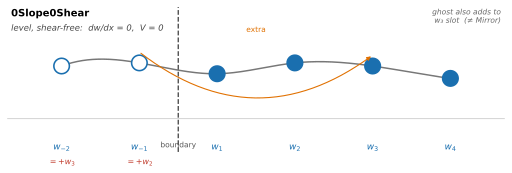

Boundary Conditions
===================

Boundary conditions specify what happens at the edges of the modelled domain.
gFlex supports six named conditions for the finite-difference (FD) solver;
each imposes constraints on which plate mechanical quantities — deflection,
slope, bending moment, and shear force — vanish at that edge.

The spectral (FFT) and analytical-superposition (SAS / SAS_NG) methods do
not use these named conditions.  FFT zero-pads the domain by
:math:`4\alpha` on each side (approximating ``NoOutsideLoads`` except when
all edges are set to ``Periodic``), and SAS / SAS_NG always assume
``NoOutsideLoads``.

The following figure from Wickert (2016) illustrates five of the six
conditions (``0Displacement0Moment`` was added after publication):

.. figure:: _static/fig4_bc_schematics.png
   :width: 55%
   :align: center
   :alt: Schematics of the five finite-difference boundary condition types

   Schematics of five FD boundary condition types (a–e) from Wickert (2016),
   Fig. 4 (`CC BY 3.0 <https://creativecommons.org/licenses/by/3.0/>`_).
   ``0Displacement0Moment`` (added post-publication) is not shown.

.. tip::

   Flexural solutions can be sensitive to boundary conditions.  When in
   doubt, use :func:`~gflex.pad_domain` (2-D) or
   :func:`~gflex.pad_domain_1d` (1-D) to push the boundaries far from the
   region of interest, and choose ``0Moment0Shear`` (free end) to minimise
   their influence.

----

Quantity names
--------------

The boundary condition names encode which plate mechanical quantities vanish
at that edge.  The table below maps each name component to its physical
meaning and derivative order.

.. list-table::
   :widths: 22 12 42 12
   :header-rows: 1

   * - Quantity
     - Symbol
     - Definition (uniform :math:`D`, 1-D)
     - :math:`w`-derivative order
   * - Deflection
     - :math:`w`
     - :math:`w`
     - 0th
   * - Slope
     - :math:`S`
     - :math:`\frac{\mathrm{d}w}{\mathrm{d}x}`
     - 1st
   * - Bending moment
     - :math:`M`
     - :math:`D\,\frac{\mathrm{d}^2 w}{\mathrm{d}x^2}`
     - 2nd
   * - Shear force
     - :math:`V`
     - :math:`D\,\frac{\mathrm{d}^3 w}{\mathrm{d}x^3}`
     - 3rd

----

Conditions
----------

The table below summarises the six conditions.  Detailed descriptions,
geological context, and ball-and-stick diagrams appear in the sections below.

.. list-table::
   :widths: 24 18 17 14 27
   :header-rows: 1

   * - gFlex name
     - Zero at boundary
     - Structural mechanics
     - Geophysical
     - Description
   * - ``0Displacement0Slope``
     - :math:`w`,\ :math:`S`
     - clamped end
     - —
     - No deflection, no rotation
   * - ``0Displacement0Moment``
     - :math:`w`,\ :math:`M`
     - simply supported
     - —
     - No deflection, free to rotate
   * - ``0Moment0Shear``
     - :math:`M`,\ :math:`V`
     - free end
     - broken plate
     - Free, unsupported plate end
   * - ``0Slope0Shear``
     - :math:`S`,\ :math:`V`
     - guided end
     - —
     - Plate is level at edge, free to deflect; no shear
   * - ``Mirror``
     - :math:`S`,\ :math:`V`
     - —
     - —
     - Even reflection; model half of a symmetric system
   * - ``Periodic``
     - —
     - —
     - —
     - Domain tiles infinitely in both directions

The "Geophysical" column reflects established usage in the lithospheric
flexure literature.  Only ``0Moment0Shear`` carries a geophysical-specific
name ("broken plate"); the remaining conditions are referred to by their
structural-mechanics names, or have no name at all.  This is a genuine gap
in the discipline's vocabulary rather than a gap in documentation.

----

0Displacement0Slope
-------------------

Zero displacement and zero slope: the plate is fully clamped at the
boundary — no deflection and no rotation.

*Standard names:* **clamped end** (structural mechanics).  No established
geophysical name.

*Geological context:* No natural lithospheric analogue has been identified.
The condition physically requires the plate to be rigidly anchored against
both vertical movement and rotation at its edge, which has no clear
counterpart in Earth's lithosphere.  In practice it serves as a
conservative far-field constraint: when the domain boundary is placed far
from any load and the plate is expected to be undisturbed there, clamping
holds the plate at zero and zero slope — somewhat more conservative than
the free-end condition at the same location.  It is most appropriate as a
boundary for a synthetic or test model, not as a representation of a
physical plate edge.

.. figure:: _static/bc_diagram_0Displacement0Slope.svg
   :width: 80%
   :align: center
   :alt: Diagram of the 0Displacement0Slope (clamped end) boundary condition

   *Clamped end* — zero deflection and zero slope at the boundary.

0Displacement0Moment
--------------------

Zero displacement and zero bending moment: the classical simply-supported
(pinned) plate end.  The plate is held at zero deflection but is free to
rotate, so no moment is transmitted.  Implemented as a Dirichlet condition
(:math:`w = 0`) at the boundary node and an odd-reflection ghost
(:math:`w_\text{ghost} = -w_\text{interior}`) at the first interior node
to enforce zero curvature.

*Standard names:* **simply supported** or **pinned end** (structural
mechanics).  No established geophysical name.

*Geological context:* No natural lithospheric analogue has been identified.
The condition is a mathematical convenience rather than a physical one: it
is the natural condition for sine-series (Discrete Sine Transform) spectral
solutions, where pinning both ends in deflection and freeing them in moment
yields an odd-periodic extension that supports spectral computation without
edge artefacts.  Sine modes vanish at a simply-supported boundary; cosine
modes vanish at a ``Mirror`` boundary (see below).

.. _contrast-with-mirror:

Contrast with Mirror
~~~~~~~~~~~~~~~~~~~~

``Mirror`` and ``0Displacement0Moment`` are both reflection boundary
conditions but encode opposite parities.  ``Mirror`` uses an *even*
reflection (:math:`w_\text{ghost} = +w_\text{interior}`): the symmetry
plane lies between the last real node and its ghost, the plate is horizontal
at the boundary, and the deflection there is generally non-zero — making it
the correct choice for modelling one half of a symmetric system.
``0Displacement0Moment`` uses an *odd* reflection
(:math:`w_\text{ghost} = -w_\text{interior}`): the boundary node is the
fixed point of the reflection, so :math:`w = 0` there by definition, and
the plate is free to rotate — the simply-supported end.  Sine modes
satisfy ``0Displacement0Moment``; cosine modes satisfy ``Mirror``.

.. figure:: _static/bc_diagram_0Displacement0Moment.svg
   :width: 80%
   :align: center
   :alt: Diagram of the 0Displacement0Moment (simply supported) boundary condition

   *Simply supported* — zero deflection, free to rotate; no bending moment transmitted.

0Moment0Shear
-------------

The natural condition at a free edge: no bending moment and no shear
force are transmitted across the boundary (Wickert, 2016, Table 1).  It
is the far-field condition into which a flexed plate decays.  Combined
with an edge-applied load — a vertical point force supplies
:math:`V_0`, a closely-spaced couple supplies :math:`M_0` — it produces
the classical broken-plate response of Turcotte and Schubert: the load
carries the inhomogeneity through the loading vector while the BC matrix
stays homogeneous.

*Standard names:* **free end** or **free edge** (structural mechanics);
**broken plate** (geophysics).  "Broken plate" is well established in the
lithospheric flexure literature, referring to a plate whose edge is
fractured and therefore transmits neither bending moment nor shear.

*Geological context:* ``0Moment0Shear`` is the most physically motivated
of the six conditions for Earth science applications:

- Far-field boundary of an interior-loaded domain, where the plate
  decays smoothly to its reference level away from the load
- Passive or rifted continental margin, where the plate edge is
  effectively free
- Broken-plate flexure (Turcotte & Schubert) with an edge load applied
  at the boundary node
- Subduction trench and outer rise, where slab pull acts as an
  edge-applied vertical force

.. figure:: _static/bc_diagram_0Moment0Shear.svg
   :width: 80%
   :align: center
   :alt: Diagram of the 0Moment0Shear (free end) boundary condition

   *Free end* — no bending moment and no shear force; the plate ends freely ("broken plate").

0Slope0Shear
------------

Zero slope and zero shear force: the plate is level at the boundary but
free to deflect there, with no shear transmitted.  Wickert (2016) calls
this "free displacement of a horizontally clamped boundary."

*Standard names:* **guided end** (structural mechanics).  No established
geophysical name.

*Geological context:* No geophysical use case has been identified for this
condition, and gFlex issues a warning when it is selected.  Although it
superficially resembles ``Mirror`` — both enforce zero slope at the
boundary — the two use different finite-difference stencils and produce
noticeably different solutions, including well away from the boundary.
``Mirror`` agrees with analytical solutions for symmetric problems;
``0Slope0Shear`` does not.  For any problem involving a plane of symmetry,
``Mirror`` is the correct choice.

``0Slope0Shear`` is retained for mathematical completeness.

   *Guided end* — zero slope, no shear force; plate is level and free to deflect.

Mirror
------

Even reflection at the boundary: the system is identical on both sides,
so only half the domain need be modelled.  The deflection at the ghost
node beyond the boundary equals the deflection at the corresponding
interior node (:math:`w_\text{ghost} = +w_\text{interior}`), the plate is
horizontal at the boundary, and the deflection there is generally non-zero.
Naturally compatible with cosine-series (Discrete Cosine Transform)
solutions.  For the distinction between even and odd reflections, see
:ref:`contrast-with-mirror` in the ``0Displacement0Moment`` section above.

*Standard names:* No standard structural-mechanics or geophysical name.
The condition is universally understood as a symmetry or mirror boundary.

*Geological context:* ``Mirror`` applies wherever the load and plate
geometry are symmetric about the boundary plane:

- One flank of a mountain range, orogenic belt, or subduction trench
- One side of a continental ice sheet or ice cap
- Half of a foreland basin profile
- One quarter of a bilaterally symmetric ice dome or volcanic edifice
  (``Mirror`` on two perpendicular axes)

.. figure:: _static/bc_diagram_Mirror.svg
   :width: 80%
   :align: center
   :alt: Diagram of the Mirror (symmetry plane) boundary condition

   *Symmetry plane* — even reflection; use when the system is symmetric about the boundary.

Periodic
--------

Wrap-around: the domain tiles infinitely in both directions, and the
solution wraps so that opposite edges are connected.  Native to FFT-based
spectral solutions, where periodicity is inherent to the transform.

*Standard names:* No standard structural-mechanics or geophysical name.

*Geological context:* ``Periodic`` is appropriate when the load pattern
genuinely repeats, or when the domain is large enough relative to the
flexural wavelength that the periodic images of the load do not influence
the region of interest:

- Seamount or volcanic chain
- Long linear load — mountain belt, fold-and-thrust belt, subduction
  trench, or rift system — where individual valley structure is below
  the flexural wavelength (though ``Mirror`` at both flanks may be
  preferable for a bilaterally symmetric belt)
- Continental-scale glacial load
- Broad-scale FFT calculations

.. figure:: _static/bc_diagram_Periodic.svg
   :width: 80%
   :align: center
   :alt: Diagram of the Periodic boundary condition

   *Periodic* — the domain wraps around; opposite edges are connected.
