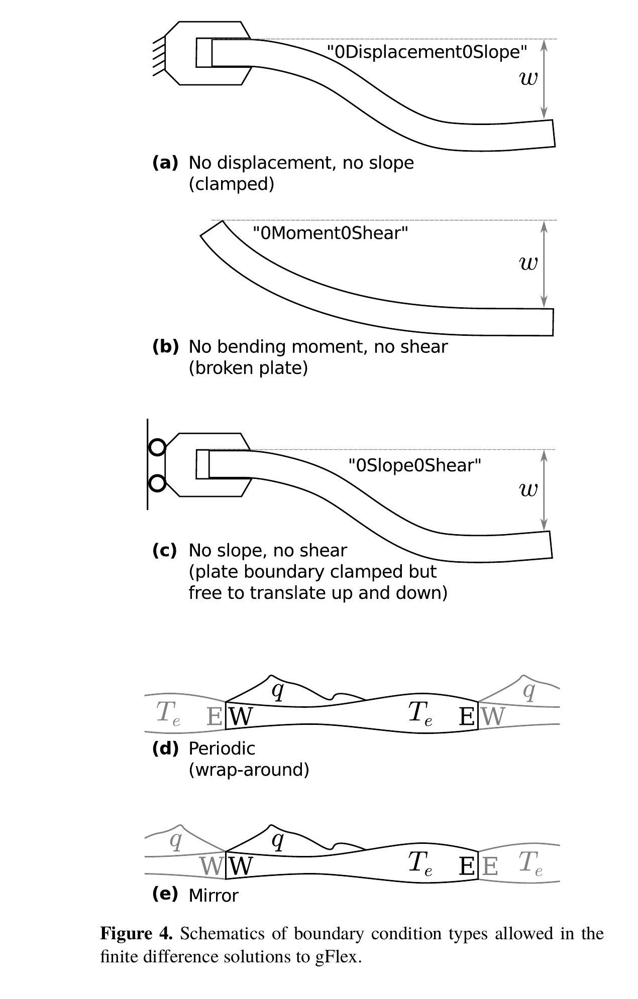
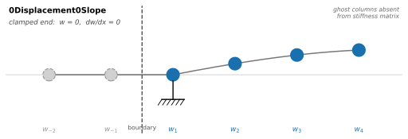
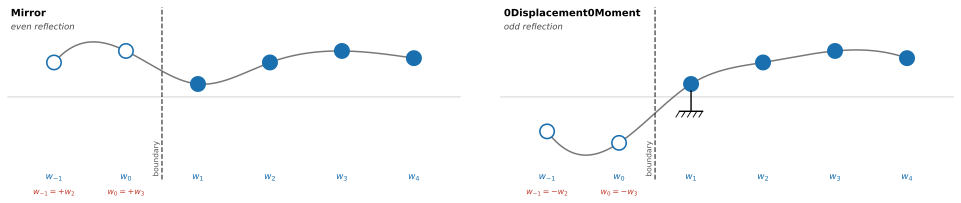
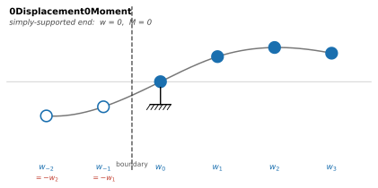
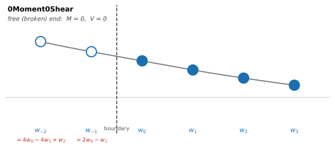
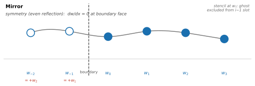
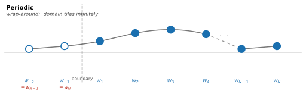

Boundary Conditions
===================

Boundary conditions specify what happens at the edges of the modelled domain.
gFlex supports five named conditions for the finite-difference (FD) solver;
each imposes constraints on which plate mechanical quantities — deflection,
slope, bending moment, and shear force — vanish at that edge.
(``zero_slope_zero_shear`` is accepted as a deprecated alias for ``mirror``
and is not a distinct condition.)

The spectral (FFT) and analytical-superposition (SAS / SAS_NG) methods do
not use these named conditions.  FFT zero-pads the domain by
:math:`4\alpha` on each side (approximating ``no_outside_loads`` except when
all edges are set to ``periodic``), and SAS / SAS_NG always assume
``no_outside_loads``.

The following figure from Wickert (2016) illustrates four of the five
conditions (``zero_displacement_zero_moment`` was added after publication):

   Schematics of five FD boundary condition types (a–e) from Wickert (2016),
   Fig. 4 (`CC BY 3.0 <https://creativecommons.org/licenses/by/3.0/>`_).
   ``zero_displacement_zero_moment`` (added post-publication) is not shown.

.. tip::

   Flexural solutions can be sensitive to boundary conditions.  When in
   doubt, use :func:`~gflex.pad_domain` (2-D) or
   :func:`~gflex.pad_domain_1d` (1-D) to push the boundaries far from the
   region of interest, and choose ``zero_moment_zero_shear`` (free end) to minimise
   their influence.

----

Quantity names
--------------

The boundary condition names encode which plate mechanical quantities vanish
at that edge.  The table below maps each name component to its physical
meaning and derivative order.

.. list-table::
   :widths: 22 12 42 12
   :header-rows: 1

   * - Quantity
     - Symbol
     - Definition (uniform :math:`D`, 1-D)
     - :math:`w`-derivative order
   * - Deflection
     - :math:`w`
     - :math:`w`
     - 0th
   * - Slope
     - :math:`S`
     - :math:`\frac{\mathrm{d}w}{\mathrm{d}x}`
     - 1st
   * - Bending moment
     - :math:`M`
     - :math:`D\,\frac{\mathrm{d}^2 w}{\mathrm{d}x^2}`
     - 2nd
   * - Shear force
     - :math:`V`
     - :math:`D\,\frac{\mathrm{d}^3 w}{\mathrm{d}x^3}`
     - 3rd

----

Conditions
----------

The table below summarises the five conditions.  Detailed descriptions,
geological context, and ball-and-stick diagrams appear in the sections below.

.. list-table::
   :widths: 24 18 17 14 27
   :header-rows: 1

   * - gFlex name
     - Zero at boundary
     - Structural mechanics
     - Geophysical
     - Description
   * - ``zero_displacement_zero_slope``
     - :math:`w`,\ :math:`S`
     - clamped end
     - —
     - No deflection, no rotation
   * - ``zero_displacement_zero_moment``
     - :math:`w`,\ :math:`M`
     - simply supported
     - —
     - No deflection, free to rotate
   * - ``zero_moment_zero_shear``
     - :math:`M`,\ :math:`V`
     - free end
     - broken plate
     - Free, unsupported plate end
   * - ``mirror`` (alias: ``zero_slope_zero_shear``)
     - :math:`S`,\ :math:`V`
     - —
     - mirror
     - Even reflection; model half of a symmetric system
   * - ``periodic``
     - —
     - —
     - —
     - Domain tiles infinitely in both directions

The "Geophysical" column reflects established usage in the lithospheric
flexure literature.  ``zero_moment_zero_shear`` is known as the "broken plate"
condition; ``mirror`` is used under that name in geophysical modeling.
The remaining conditions are referred to by their structural-mechanics names,
or have no name at all.

.. deprecated:: 2.0

   The v1.x PascalCase boundary-condition strings are no longer accepted.
   Rename them as follows:

   ================================  ===================================
   Old name (v1.x)                   New name (v2.0+)
   ================================  ===================================
   ``0Displacement0Slope``           ``zero_displacement_zero_slope``
   ``0Displacement0Moment``          ``zero_displacement_zero_moment``
   ``0Moment0Shear``                 ``zero_moment_zero_shear``
   ``0Slope0Shear``                  ``zero_slope_zero_shear``
   ``Mirror``                        ``mirror``
   ``Periodic``                      ``periodic``
   ``NoOutsideLoads``                ``no_outside_loads``
   ================================  ===================================

----

zero_displacement_zero_slope
----------------------------

Zero displacement and zero slope: the plate is fully clamped at the
boundary — no deflection and no rotation.

*Standard names:* **clamped end** (structural mechanics).  No established
geophysical name.

*Geological context:* No natural lithospheric analogue has been identified.
The condition physically requires the plate to be rigidly anchored against
both vertical movement and rotation at its edge, which has no clear
counterpart in Earth's lithosphere.  In practice it serves as a
conservative far-field constraint: when the domain boundary is placed far
from any load and the plate is expected to be undisturbed there, clamping
holds the plate at zero and zero slope — somewhat more conservative than
the free-end condition at the same location.  It is most appropriate as a
boundary for a synthetic or test model, not as a representation of a
physical plate edge.

   *Clamped end* — zero deflection and zero slope at the boundary.

zero_displacement_zero_moment
-----------------------------

Zero displacement and zero bending moment: the classical simply-supported
(pinned) plate end.  The plate is held at zero deflection but is free to
rotate, so no moment is transmitted.  Implemented as a Dirichlet condition
(:math:`w = 0`) at the boundary node and an odd-reflection ghost
(:math:`w_\text{ghost} = -w_\text{interior}`) at the first interior node
to enforce zero curvature.

*Standard names:* **simply supported** or **pinned end** (structural
mechanics).  No established geophysical name.

*Geological context:* No natural lithospheric analogue has been identified.
The condition is a mathematical convenience rather than a physical one: it
is the natural condition for sine-series (Discrete Sine Transform) spectral
solutions, where pinning both ends in deflection and freeing them in moment
yields an odd-periodic extension that supports spectral computation without
edge artefacts.  Sine modes vanish at a simply-supported boundary; cosine
modes vanish at a ``mirror`` boundary (see below).

.. _contrast-with-mirror:

Contrast with mirror
~~~~~~~~~~~~~~~~~~~~

``mirror`` and ``zero_displacement_zero_moment`` are both reflection boundary
conditions but encode opposite parities.  ``mirror`` uses an *even*
reflection (:math:`w_\text{ghost} = +w_\text{interior}`): the symmetry
plane lies between the last real node and its ghost, the plate is horizontal
at the boundary, and the deflection there is generally non-zero — making it
the correct choice for modelling one half of a symmetric system.
``zero_displacement_zero_moment`` uses an *odd* reflection
(:math:`w_\text{ghost} = -w_\text{interior}`): the boundary node is the
fixed point of the reflection, so :math:`w = 0` there by definition, and
the plate is free to rotate — the simply-supported end.  Sine modes
satisfy ``zero_displacement_zero_moment``; cosine modes satisfy ``mirror``.

   Even reflection (``mirror``, left) vs. odd reflection (``zero_displacement_zero_moment``, right):
   the same four real nodes produce ghost values of opposite sign.

   *Simply supported* — zero deflection, free to rotate; no bending moment transmitted.

zero_moment_zero_shear
----------------------

The natural condition at a free edge: no bending moment and no shear
force are transmitted across the boundary (Wickert, 2016, Table 1).
Combined with an edge-applied load — a vertical point force supplies
:math:`V_0`, a closely-spaced couple supplies :math:`M_0` — it produces
the classical broken-plate response of Turcotte and Schubert: the load
carries the inhomogeneity through the loading vector while the BC matrix
stays homogeneous.

*Standard names:* **free end** or **free edge** (structural mechanics);
**broken plate** (geophysics).  "Broken plate" is well established in the
lithospheric flexure literature, referring to a plate whose edge is
fractured and therefore transmits neither bending moment nor shear.

*Geological context:* ``zero_moment_zero_shear`` is the most physically motivated
of the six conditions for Earth science applications:

- Passive or rifted continental margin, where the plate edge is
  effectively free
- Broken-plate flexure (Turcotte & Schubert) with an edge load applied
  at the boundary node
- Subduction trench and outer rise, where slab pull acts as an
  edge-applied vertical force

   *Free end* — no bending moment and no shear force; the plate ends freely ("broken plate").

mirror
------

Even reflection at the boundary: the system is identical on both sides,
so only half the domain need be modelled.  The deflection at the ghost
node beyond the boundary equals the deflection at the corresponding
interior node (:math:`w_\text{ghost} = +w_\text{interior}`), the plate is
horizontal at the boundary, and the deflection there is generally non-zero.
Naturally compatible with cosine-series (Discrete Cosine Transform)
solutions.  For the distinction between even and odd reflections, see
:ref:`contrast-with-mirror` in the ``zero_displacement_zero_moment`` section above.

*Standard names:* No standard structural-mechanics or geophysical name.
The condition is universally understood as a symmetry or mirror boundary.

*Why* ``zero_slope_zero_shear`` *is an alias:* the even-reflection ghost
node (:math:`w_\text{ghost} = +w_\text{interior}`) makes both the slope
and the shear force vanish at the boundary automatically.  In the
central-difference stencil, the slope at the boundary node is

.. math::

   \frac{\mathrm{d}w}{\mathrm{d}x} \approx
   \frac{w_\text{interior} - w_\text{ghost}}{2\,\Delta x}
   = \frac{w_\text{interior} - w_\text{interior}}{2\,\Delta x} = 0,

and the third derivative (shear force) similarly cancels by the same
even symmetry:

.. math::

   \frac{\mathrm{d}^3 w}{\mathrm{d}x^3} \approx
   \frac{w_{i+2} - 2w_{i+1} + 2w_{i-1} - w_{i-2}}{2\,\Delta x^3}
   \xrightarrow{w_{i-k}=w_{i+k}} 0.

The ``mirror`` ghost-node rule therefore simultaneously enforces
:math:`\mathrm{d}w/\mathrm{d}x = 0` and
:math:`\mathrm{d}^3w/\mathrm{d}x^3 = 0` — precisely the
``zero_slope_zero_shear`` prescription.  The two names reach the same
stencil by different routes and are mathematically identical.
The string ``'zero_slope_zero_shear'`` is accepted for backwards
compatibility and is normalised to ``'mirror'`` internally.

*Geological context:* ``mirror`` applies wherever the load and plate
geometry are symmetric about the boundary plane:

- One flank of a mountain range, orogenic belt, or subduction trench
- One side of a continental ice sheet or ice cap
- Half of a foreland basin profile
- One quarter of a bilaterally symmetric ice dome or volcanic edifice
  (``mirror`` on two perpendicular axes)

   *Symmetry plane* — even reflection; use when the system is symmetric about the boundary.

periodic
--------

Wrap-around: the domain tiles infinitely in both directions, and the
solution wraps so that opposite edges are connected.  Native to FFT-based
spectral solutions, where periodicity is inherent to the transform.

*Standard names:* No standard structural-mechanics or geophysical name.

*Geological context:* ``periodic`` is appropriate when the load pattern
genuinely repeats, or when the domain is large enough relative to the
flexural wavelength that the periodic images of the load do not influence
the region of interest:

- Seamount or volcanic chain
- Long linear load — mountain belt, fold-and-thrust belt, subduction
  trench, or rift system — where individual valley structure is below
  the flexural wavelength (though ``mirror`` at both flanks may be
  preferable for a bilaterally symmetric belt)
- Continental-scale glacial load
- Broad-scale FFT calculations

   *periodic* — the domain wraps around; opposite edges are connected.

----

Prescribed (non-zero) boundary values
--------------------------------------

By default every boundary condition above enforces **homogeneous** constraints
— the two named quantities are zero at the edge.  The finite-difference solver
also supports **prescribed (non-zero)** values by passing a ``dict`` in place
of a BC string.  This is the natural way to model a plate whose edge carries
an applied load: for example, prescribing the shear force at a free end to
represent slab pull at an ocean trench (the classical broken-plate scenario
of Turcotte and Schubert, 2002), or setting a non-zero boundary displacement
when coupling gFlex to another model.

This is available in :class:`~gflex.F1D` and :class:`~gflex.F2D` with
``method = 'fd'``.  Passing a dict BC to any other solver raises
:exc:`ValueError`.

Relationship to string BCs
~~~~~~~~~~~~~~~~~~~~~~~~~~~

A dict BC uses the **same finite-difference stencil** as the equivalent string
BC.  The prescribed values enter as an additive correction to the right-hand
side of the linear system — the coefficient matrix is unchanged.  As a
consequence, ``{"moment": 0.0, "shear": 0.0}`` produces exactly the same
solution as the string ``"zero_moment_zero_shear"``: both constrain the same
stencil structure and the RHS correction is zero.  Only non-zero values
change the solution.

Syntax
~~~~~~

Set the BC attribute for a given edge to a dict with exactly two keys, where
each key names a plate mechanical quantity and each value is either a scalar
or a 1-D NumPy array:

.. code-block:: python

   flex.bc_west = {"moment": 0.0, "shear": V0}          # broken-plate edge load
   flex.bc_west = {"displacement": 0.0, "slope": theta}  # prescribed rotation
   flex.bc_east = {"displacement": w_array, "moment": 0.0}

The four valid keys are:

.. list-table::
   :header-rows: 1
   :widths: 15 12 73

   * - Key
     - Symbol
     - Prescribed quantity
   * - ``"displacement"``
     - :math:`w`
     - Vertical deflection [m]
   * - ``"slope"``
     - :math:`dw/dx`
     - Plate slope (dimensionless)
   * - ``"moment"``
     - :math:`M`
     - Bending moment per unit edge length [N, i.e. N·m m⁻¹]
   * - ``"shear"``
     - :math:`V`
     - Shear force per unit edge length [N m⁻¹]

Valid pairs
~~~~~~~~~~~

Each dict must contain exactly **two** keys whose combination corresponds to
one of the four supported BC types:

.. list-table::
   :header-rows: 1
   :widths: 40 60

   * - Dict keys
     - Equivalent homogeneous BC
   * - ``{"displacement", "slope"}``
     - ``zero_displacement_zero_slope``
   * - ``{"displacement", "moment"}``
     - ``zero_displacement_zero_moment``
   * - ``{"moment", "shear"}``
     - ``zero_moment_zero_shear``
   * - ``{"slope", "shear"}``
     - ``zero_slope_zero_shear``

The two work-conjugate pairs — ``{"displacement", "shear"}`` and
``{"slope", "moment"}`` — are ill-posed and raise :exc:`ValueError`.

Array values (2-D only)
~~~~~~~~~~~~~~~~~~~~~~~

In 2-D, values may be 1-D arrays that vary along the edge.  An array
assigned to a north or south edge must have length equal to the number of
columns; one assigned to a west or east edge must have length equal to the
number of rows.  Scalar values are broadcast to the full edge.

Example: broken-plate edge load (1-D)
~~~~~~~~~~~~~~~~~~~~~~~~~~~~~~~~~~~~~~

The classical broken-plate scenario (Turcotte & Schubert, 2002) represents a
semi-infinite oceanic plate carrying a vertical point force :math:`V_0` at the
trench end — the idealisation of slab pull at a subduction zone.  The plate
bends downward at the trench and a forebulge (outer rise) develops at
approximately :math:`\pi\alpha/2` from the loaded end.

The boundary condition is zero moment and prescribed (downward) shear at the
west end, with a free ``zero_moment_zero_shear`` condition at the far east end:

.. code-block:: python

   import numpy as np
   from gflex import F1D

   # Physical parameters
   E        = 65e9     # Pa — Young's modulus
   nu       = 0.25
   rho_m    = 3300.0   # kg m⁻³ — mantle density
   rho_fill = 0.0      # kg m⁻³ — air infill
   g        = 9.8      # m s⁻²
   Te       = 30e3     # m  — elastic thickness

   # Derived quantities
   D     = E * Te**3 / (12.0 * (1.0 - nu**2))          # flexural rigidity
   lam   = ((rho_m - rho_fill) * g / (4.0 * D)) ** 0.25
   alpha = 1.0 / lam                                    # flexural parameter ≈ 66 km

   # Domain: 10 α long, 401 nodes
   nx = 401
   dx = 10.0 * alpha / (nx - 1)

   # Slab-pull shear force at the trench (negative = downward), N/m
   V0 = -1e12

   flex = F1D()
   flex.quiet    = True
   flex.method   = 'fd'
   flex.g = g;  flex.E = E;  flex.nu = nu
   flex.rho_m = rho_m;  flex.rho_fill = rho_fill
   flex.te       = Te
   flex.qs       = np.zeros(nx)   # no distributed load — forcing is at the boundary
   flex.dx       = dx
   flex.bc_west  = {"moment": 0.0, "shear": V0}   # trench: zero moment, prescribed shear
   flex.bc_east  = "zero_moment_zero_shear"         # free far end

   flex.initialize()
   flex.run()
   w = flex.w   # deflection [m]; w[0] ≈ −933 m (trench), forebulge ≈ +63 m at x ≈ 156 km
   flex.finalize()

The result matches the analytical solution
:math:`w(x) = \frac{V_0}{2D\lambda^3}\,e^{-\lambda x}\cos(\lambda x)`
to within 0.02 % (L-∞ relative error).

A standalone version of this script with plotting is provided in
``input/run_in_script_prescribed_bc_1D.py``.
