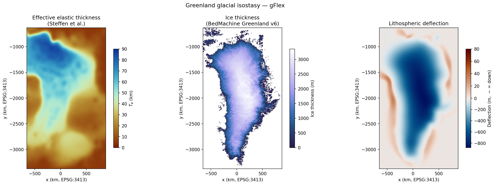
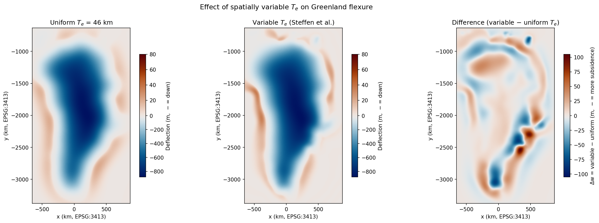
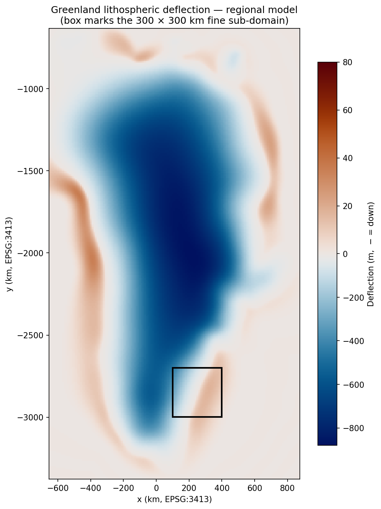
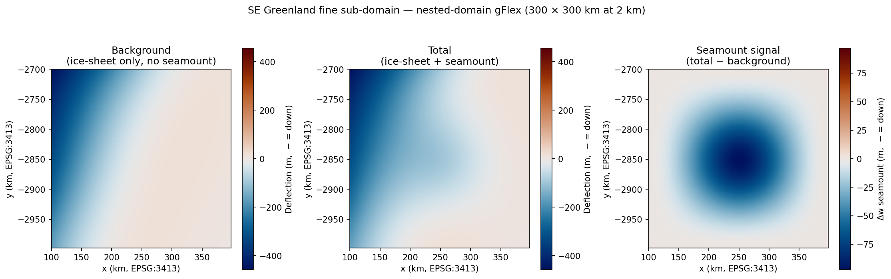

Example: Greenland
==================

This page works through two related problems using Greenland as the study area.
The first is a realistic model of present-day lithospheric deflection under the
Greenland ice sheet, using publicly available ice-thickness and elastic-thickness
datasets.  The second is a hypothetical extension that uses the regional model as
the starting point for a finer-scale nested solve, specifically to illustrate how
**inhomogeneous (prescribed-value) boundary conditions** let a local model
inherit its boundary state from a coarser regional solve.  A Gaussian seamount —
purely hypothetical — is then added to the local model to show how a new coastal
load perturbs the plate on top of the existing ice-sheet deformation field.

Scripts: ``examples/greenland_flexure.py`` (regional model) and
``examples/greenland_volcano_nested.py`` (nested model).

Datasets
--------

Both scripts draw on the same two datasets.

**Ice thickness** — BedMachine Greenland v6 (Morlighem et al. 2017, 2025),
available from NSIDC (Earthdata login required).  The native 150 m grid is
subsampled to ~10 km before passing to gFlex; at that resolution each FD solve
takes a few seconds.

**Elastic thickness** — Steffen et al. (2018, 2026), freely available under
CC-BY-4.0 from Zenodo
(`doi:10.5281/zenodo.18403685 <https://doi.org/10.5281/zenodo.18403685>`_).
The script downloads this file automatically on first run.  The dataset provides
:math:`T_e` in km at 0.2° geographic spacing over the greater Greenland region;
values range from 5 to 87 km, reflecting the contrast between the weak western
margin and the cratonic interior.

Regional ice-sheet model
------------------------

Setup
~~~~~

The BedMachine grid is already in EPSG:3413 (NSIDC Sea Ice Polar Stereographic
North).  The Steffen et al. data is in geographic lon/lat and must be
reprojected onto the same EPSG:3413 grid using :mod:`pyproj` and
:class:`scipy.interpolate.RegularGridInterpolator`.  Cells outside the Te
dataset coverage are assigned the domain median.

Only **grounded ice** (BedMachine mask == 2) contributes to the surface load;
floating ice is hydrostatically supported by the ocean and is excluded.  The
load is :math:`q_s = \rho_\text{ice}\,g\,H_\text{ice}` with
:math:`\rho_\text{ice} = 917` kg m⁻³.

Boundary conditions and domain padding
~~~~~~~~~~~~~~~~~~~~~~~~~~~~~~~~~~~~~~~

A clamped boundary condition (``zero_displacement_zero_slope``) is applied on
all four sides.  This requires that deflections approach zero before the domain
edge — enforced here by calling :func:`~gflex.pad_domain` with one flexural
wavelength of padding (~650 km, set by the maximum :math:`T_e` of 87 km in
the domain).  The
padding ring tapers :math:`T_e` smoothly to the domain mean and carries zero
load; after the solve the padding is trimmed from :attr:`~gflex.F2D.w` with
``w = flex.w[p:-p, p:-p]``.

Without padding the forebulge reached 61 m; with padding it is 36 m,
confirming that free-end boundary artefacts were inflating the unpadded result.

.. code-block:: python

   from gflex import F2D, pad_domain

   te_pad, qs_pad, p = pad_domain(te_proj, qs, dx=dx, dy=dy,
                                   E=65e9, nu=0.25, rho_m=3300., g=9.81)
   flex = F2D()
   flex.T_e, flex.qs = te_pad, qs_pad
   flex.dx, flex.dy = dx, dy
   flex.bc_west = flex.bc_east = flex.bc_north = flex.bc_south = \
       'zero_displacement_zero_slope'
   flex.initialize()
   flex.run()
   w = flex.w[p:-p, p:-p]   # trim padding

Results
~~~~~~~

   *Left*: effective elastic thickness :math:`T_e` (Steffen et al.;
   roma colormap).  *Centre*: ice thickness from BedMachine v6 (grounded ice
   only; devon colormap).  *Right*: computed lithospheric deflection (vik
   colormap, asymmetric scale: blue = subsidence, red = uplift).

The maximum depression is **880 m** beneath the central ice dome.  The
forebulge reaches **36 m** and is notably sharp along the east coast, where
:math:`T_e` drops steeply from the cratonic interior toward the passive margin.
That abrupt change in plate stiffness concentrates the bending and narrows the
forebulge wavelength.

Effect of spatially variable :math:`T_e`
~~~~~~~~~~~~~~~~~~~~~~~~~~~~~~~~~~~~~~~~~

Running a second solve with :math:`T_e` fixed at the ice-sheet mean
(46 km everywhere) isolates the contribution of lateral heterogeneity.

   *Left*: deflection under uniform :math:`T_e` = 46 km.
   *Centre*: deflection under the spatially variable Steffen et al.
   :math:`T_e`.  *Right*: difference (variable − uniform); red = variable
   :math:`T_e` produces more subsidence (locally weak lithosphere), blue =
   less subsidence (locally strong lithosphere).

The two total depressions agree within 1 m (both ~880 m), because the load
magnitude is dominated by the thick central ice, which sits on near-average
:math:`T_e`.  The differences are largest at the margins: up to **+105 m**
(more subsidence) where :math:`T_e` dips well below the mean along the western
coast, and up to **−85 m** (less subsidence) over the strong cratonic keel in
the southeast.  For a regional model used to infer ice-loading history or
present-day rebound rates, assuming a uniform :math:`T_e` would introduce
errors of this magnitude at the margins.

Nested-domain model: a hypothetical coastal seamount
-----------------------------------------------------

The regional model sets up a physically meaningful background state — a plate
already stressed by several hundred metres of ice-sheet deflection — against
which the effect of a new local load can be evaluated.  This second example
uses that background to illustrate how **inhomogeneous boundary conditions**
couple a coarse regional model to a fine local one.

The scenario is hypothetical: a Gaussian seamount (:math:`h_\text{peak} = 2`
km, :math:`\sigma = 20` km) appears on the SE Greenland coast near ~64°N 40°W.
The fine sub-domain is 300 × 300 km at 2 km resolution, centred where the ice
margin, the forebulge, and the open ocean all fall within a single window.

Extracting boundary conditions from the regional model
~~~~~~~~~~~~~~~~~~~~~~~~~~~~~~~~~~~~~~~~~~~~~~~~~~~~~~~

The fine model's boundary state comes entirely from the coarse solution.
At each of the four edges, displacement and slope are sampled with
:class:`scipy.interpolate.RegularGridInterpolator` and passed directly to
:class:`~gflex.F2D`:

.. code-block:: python

   import numpy as np
   from scipy.interpolate import RegularGridInterpolator

   dw_dx = np.gradient(w_coarse, dx, axis=1)   # dw/dx, positive = eastward
   dw_dy = np.gradient(w_coarse, dy, axis=0)   # dw/dy, positive = southward

   # sample at fine-domain edge coordinates via RegularGridInterpolator ...

   flex_fine.bc_west  = {"displacement": w_west,  "slope": dw_dx_west}
   flex_fine.bc_east  = {"displacement": w_east,  "slope": dw_dx_east}
   flex_fine.bc_north = {"displacement": w_north, "slope": dw_dy_north}
   flex_fine.bc_south = {"displacement": w_south, "slope": dw_dy_south}

The slope convention is the same on all four edges: the value passed as
``"slope"`` is :math:`\mathrm{d}w/\mathrm{d}x` (for west and east) or
:math:`\mathrm{d}w/\mathrm{d}y` in the row-index direction, positive southward
(for north and south).  Both are obtained from :func:`numpy.gradient` with
positive grid spacings.  This convention is verified by the round-trip unit test
``TestNestedModelGradientRoundTrip`` in ``tests/test_2D_inhomogeneous_BC.py``,
which confirms that a sub-domain re-solve with gradients extracted from a full
solve reproduces the full-domain interior to within the accuracy of the finite
difference gradient estimate.

The ice load within the fine domain is resampled from the coarse grid to 2 km
and included explicitly in the fine solve, so the boundary conditions supply
the far-field constraint while the local ice drives the near-field plate
response.

Results
~~~~~~~

Both fine-domain results are new, independent finite-difference solutions on
the 2 km grid — not subsamplings or interpolations of the coarse result.  The
prescribed displacement and slope at each boundary encode the cumulative plate
response to the *entire* ice sheet, including the bulk of the Greenland load
that lies well outside the fine window.  A homogeneous boundary condition
(e.g., clamped or free edges) would ignore that far-field loading and give a
physically wrong answer even in the domain interior.  Two solves are run with
identical boundary conditions: one with ice load only (background) and one
with ice plus the seamount load (total).  Their difference isolates the
volcanic signal.

   Regional Greenland lithospheric deflection (vik colormap, same scale as
   the regional model above).  The black box marks the 300 × 300 km fine
   sub-domain centred on the SE Greenland coast (~64°N 40°W), straddling
   the ice-sheet margin and the forebulge.

|

   *Left*: fine-model background — the transition from ice-sheet depression
   (west, over grounded ice) to forebulge (east, open ocean) is clearly
   visible within the single 300 km window.  *Centre*: total fine deflection
   (ice-sheet + seamount); the circular volcanic depression is superimposed
   on the ice-sheet pattern.  *Right*: isolated seamount signal (total −
   background); **97 m** central depression with no measurable forebulge,
   consistent with the sub-flexural load width (:math:`\sigma = 20` km
   :math:`\ll \alpha \approx 47` km for :math:`T_e \approx 30` km on the
   SE Greenland continental margin).

The background panel demonstrates that the inhomogeneous boundary conditions
successfully reproduce the regional ice-sheet deformation field inside the
fine domain: the gradient from deep depression to forebulge is smooth and
consistent with the coarse model.  This agreement is a direct consequence of
the boundary conditions carrying the far-field loading information — the fine
solver only needs to know the local ice load and the plate state at its edges,
and the rest of Greenland's influence arrives through those four boundary
arrays.  The volcanic signal panel isolates the plate response to the new load
alone, free of the much larger ice-loading signal.

References
----------

Morlighem M. et al. (2017), BedMachine v3: Complete bed topography and ocean
bathymetry mapping of Greenland from multi-beam echo sounding combined with
mass conservation, *Geophys. Res. Lett.*, 44, 11051–11061,
`doi:10.1002/2017GL074954 <https://doi.org/10.1002/2017GL074954>`_.

Morlighem M. et al. (2025), IceBridge BedMachine Greenland, Version 6
[Data Set], NASA NSIDC DAAC,
`doi:10.5067/6B6B225B8V2D <https://doi.org/10.5067/6B6B225B8V2D>`_.

Steffen R., Audet P., and Lund B. (2018), Weakened lithosphere beneath
Greenland inferred from effective elastic thickness: A hot spot effect?,
*Geophys. Res. Lett.*, 45(10), 4733–4742,
`doi:10.1029/2017GL076885 <https://doi.org/10.1029/2017GL076885>`_.

Steffen R., Audet P., Strykowski G., and Lund B. (2026), Greenland — Moho and
effective elastic thickness models based on satellite gravity data, Zenodo,
`doi:10.5281/zenodo.18403685 <https://doi.org/10.5281/zenodo.18403685>`_.
