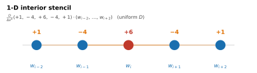
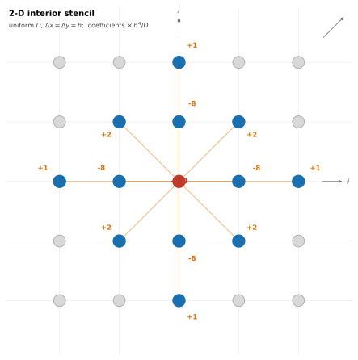

Numerical Methods
=================

gFlex solves the flexure equation by three strategies: superposition of
analytical solutions (SAS / SAS_NG), a spectral FFT solver, and a
finite-difference (FD) solver.  See :doc:`theory` for the governing
equations and a comparison of the strategies.

This page documents the FD interior stencils — the fixed-coefficient
templates applied at every grid point away from the domain boundary.
Stencils that enforce the domain boundary conditions are described in
:doc:`boundary_conditions`.

----

Finite-difference interior stencils
------------------------------------

The FD solver replaces each spatial derivative in
:math:`D\nabla^4 w = q - \Delta\rho\,g\,w` with a second-order centred
finite difference.  Applying the one-dimensional second difference twice
yields a five-point stencil; the two-dimensional biharmonic on a square
grid produces a thirteen-point stencil.  In both cases the coefficients
are fixed integers (scaled by :math:`D/\Delta x^4` in 1-D or
:math:`D/h^4` in 2-D) for uniform :math:`D`.

**1-D interior stencil** — five-point stencil spanning two nodes on
each side of the evaluation point:

   Five-point 1-D stencil:
   :math:`\tfrac{D}{\Delta x^4}(+1,\,-4,\,+6,\,-4,\,+1)` applied at
   each interior node (uniform :math:`D`).

**2-D interior stencil** — thirteen-point stencil on a square
:math:`(\Delta x = \Delta y = h)` grid: centre coefficient +20, the
four nearest neighbours −8, the four next-nearest along each axis +1,
and the four diagonal neighbours +2.

   Thirteen-point 2-D stencil for the biharmonic operator on a square
   grid (uniform :math:`D`).
