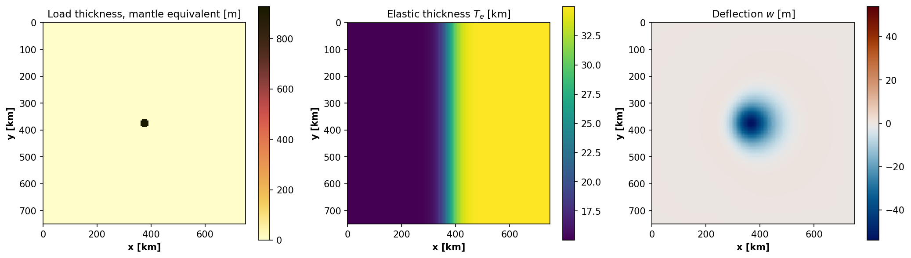
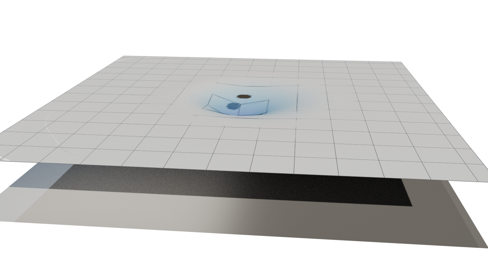

Tutorial
========

This page walks through a complete gFlex workflow using a physically motivated
2-D scenario: a circular surface load on a plate whose elastic thickness
:math:`T_e` varies smoothly from west to east.  The same scenario underlies
the gFlex logo.

The workflow covers:

* setting up the grid, material parameters, variable :math:`T_e`, and load;
* running the 2-D finite-difference solver;
* visualising results with the built-in matplotlib plots; and
* exporting to Blender for a publication-quality 3-D render.

Physical scenario
-----------------

A circular volcanic edifice sits at the centre of a 750 × 750 km domain.
The lithosphere beneath it is laterally heterogeneous: :math:`T_e` rises
from 15 km in the west to 35 km in the east across a sigmoid transition.
Thinner lithosphere deflects more sharply and over a shorter wavelength;
thicker lithosphere spreads the load farther and produces a more prominent
forebulge.

The contrast is visible in the result: the depression is asymmetric —
deeper and more confined on the soft (west) side, broader and shallower
with a clearer forebulge on the stiff (east) side.

Grid and material parameters
-----------------------------

.. code-block:: python

   import numpy as np
   from gflex import F2D

   # Grid: 150 × 150 cells at 5 km → 750 km domain
   nrows = ncols = 150
   dx = dy = 5000.0  # m

   # Physical parameters
   E        = 65e9    # Pa  — Young's modulus
   nu       = 0.25   # —   — Poisson's ratio
   rho_m    = 3300.0  # kg m⁻³ — mantle density
   rho_fill = 0.0    # kg m⁻³ — infill density (air)
   g        = 9.8    # m s⁻²

   # Cell-centre coordinate arrays
   xi = (np.arange(ncols) + 0.5) * dx
   yi = (np.arange(nrows) + 0.5) * dy
   XX, YY = np.meshgrid(xi, yi)
   cx = cy = 0.5 * nrows * dx   # domain centre

Variable elastic thickness
--------------------------

A sigmoid transition from :math:`T_e = 15` km (west) to
:math:`T_e = 35` km (east) over a characteristic length of
:math:`8\,\Delta x = 40` km:

.. code-block:: python

   Te_min, Te_max = 15e3, 35e3          # m
   x_norm  = (XX - cx) / (8 * dx)      # normalised distance from centre
   Te_grid = Te_min + (Te_max - Te_min) * 0.5 * (1.0 + np.tanh(x_norm))

Circular load
-------------

The load radius is set to :math:`1.5\alpha`, where :math:`\alpha` is the
flexural parameter computed from the mean :math:`T_e`:

.. math::

   \alpha = \left(\frac{D}{\Delta\rho\,g}\right)^{1/4},
   \quad D = \frac{E\,T_e^3}{12(1-\nu^2)}

.. code-block:: python

   Te_mean  = Te_grid.mean()
   D_mean   = E * Te_mean**3 / (12.0 * (1.0 - nu**2))
   alpha    = (D_mean / ((rho_m - rho_fill) * g))**0.25

   load_radius = 1.5 * alpha
   R  = np.sqrt((XX - cx)**2 + (YY - cy)**2)
   qs = np.where(R <= load_radius, 3e7, 0.0)   # 30 MPa inside, 0 outside

A 30 MPa load over a ~60 km-radius circle is equivalent to roughly
930 m of mantle-density rock — comparable to a large volcanic plateau
or the distal part of a sedimentary basin.

Running gFlex
-------------

.. code-block:: python

   flex = F2D()
   flex.quiet = True

   flex.method  = 'fd'

   flex.g        = g;     flex.E  = E;    flex.nu = nu
   flex.rho_m    = rho_m; flex.rho_fill = rho_fill
   flex.te       = Te_grid
   flex.qs       = qs
   flex.dx       = dx;    flex.dy = dy

   flex.bc_west = flex.bc_east = flex.bc_south = flex.bc_north = 'zero_moment_zero_shear'

   flex.initialize()
   flex.run()

   w = flex.w   # deflection array [m]; negative = downward
   # flex.output() here to save/plot via the built-in helpers.
   # flex.finalize() when you are done with w and qs (frees all state).

The result: ~54 m of central subsidence and ~1 m of forebulge uplift.
The asymmetry between the west (soft) and east (stiff) sides is clear in
the output.

Matplotlib visualisation
------------------------

The built-in ``Plotting()`` method produces a figure for whatever outputs
are available.  For a 2-D run, call ``twoSurfplots()`` directly; when
``Te`` is a 2-D array it shows three panels (load, elastic thickness,
deflection):

.. code-block:: python

   import matplotlib.pyplot as plt

   flex.twoSurfplots()   # load, Te, and deflection (three panels for 2-D Te)
   plt.show()

Or, for the three-panel view used in this example (load, :math:`T_e`,
deflection side by side), plot the arrays directly:

.. code-block:: python

   from cmcrameri import cm as cmc   # pip install cmcrameri

   w_abs = float(np.abs(flex.w).max())

   fig, axes = plt.subplots(1, 3, figsize=(14, 4.5))

   axes[0].imshow(flex.qs / (rho_m * g),
       extent=(0, dx/1000*ncols, dy/1000*nrows, 0),
       cmap=cmc.lajolla_r, aspect='equal')
   axes[0].set_title("Load thickness, mantle equivalent [m]")

   axes[1].imshow(flex.te / 1e3,
       extent=(0, dx/1000*ncols, dy/1000*nrows, 0),
       cmap=cmc.roma, aspect='equal')
   axes[1].set_title(r"Elastic thickness $T_e$ [km]")

   axes[2].imshow(flex.w,
       extent=(0, dx/1000*ncols, dy/1000*nrows, 0),
       cmap=cmc.vik, vmin=-w_abs, vmax=w_abs, aspect='equal')
   axes[2].set_title(r"Deflection $w$ [m]")

   for ax in axes:
       ax.set_xlabel("x [km]"); ax.set_ylabel("y [km]")
   plt.tight_layout(); plt.show()

   *Left*: circular load (dark = heavier; lajolla_r colormap).
   *Centre*: sigmoid :math:`T_e` transition from 15 km (west, warm red) to
   35 km (east, cool blue-green); roma colormap.
   *Right*: deflection coloured with the *vik* diverging colormap
   (blue = subsidence, red = uplift); the asymmetry between soft and stiff
   sides is clearly visible.

3-D render with Blender
-----------------------

:func:`gflex.export_for_blender` converts the deflection array into a
pure-Python mesh file that Blender's embedded interpreter can read without
NumPy or gFlex installed:

.. code-block:: python

   from gflex import export_for_blender

   export_for_blender(
       flex.w, flex.dx,
       path='/tmp/gflex_blender_mesh.py',
       z_exaggeration=200.0,
       qs=flex.qs,
       Te=flex.te,
       rho_m=rho_m,
       g=g,
   )

Then render headless with the companion scene script:

.. code-block:: bash

   blender --background --python docs/examples/blender_flexure.py

The script reads ``/tmp/gflex_blender_mesh.py`` by default (edit the
``MESH_FILE`` constant at the top to change the path) and writes a PNG with a
transparent background, ready to composite into a paper or presentation.

   Blender render of the same scenario: *vik*-coloured deflection surface,
   wireframe :math:`T_e` grid, :math:`T_e` floor slab, and dark basalt load
   cylinder whose base deforms with the plate.  Vertical exaggeration is 200×;
   the domain is 750 × 750 km.

Logo scripts
------------

The scripts in ``docs/logo/`` reproduce this exact scenario at the
settings used for the gFlex logo:

* ``generate_logo_data.py`` — runs gFlex and saves ``/tmp/gflex_logo_data.npz``.
* ``blender_logo.py`` — Blender scene script tailored for the logo (fixed
  camera angle, load cylinder, specific lighting).
* ``add_logo_text.py`` — composites the "gFlex" wordmark onto the rendered PNG.
* ``make_logo.sh`` — shell script that runs all three steps in sequence.

These differ from the general ``docs/examples/blender_flexure.py`` in that
they are tuned for logo aesthetics (camera framing, load representation,
text overlay) rather than scientific figure production.
